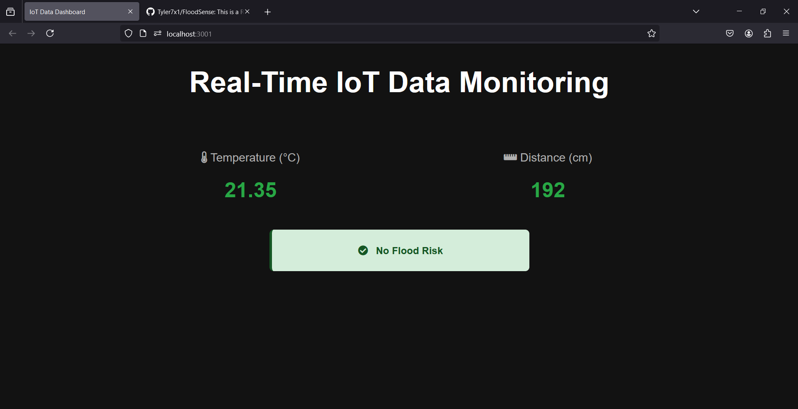
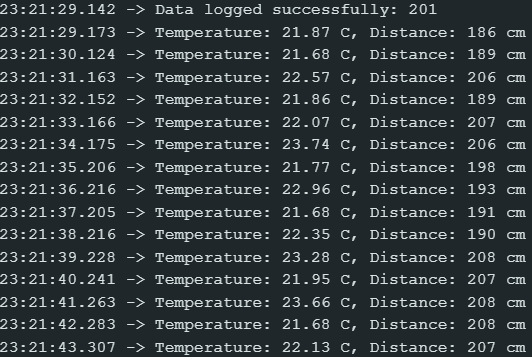
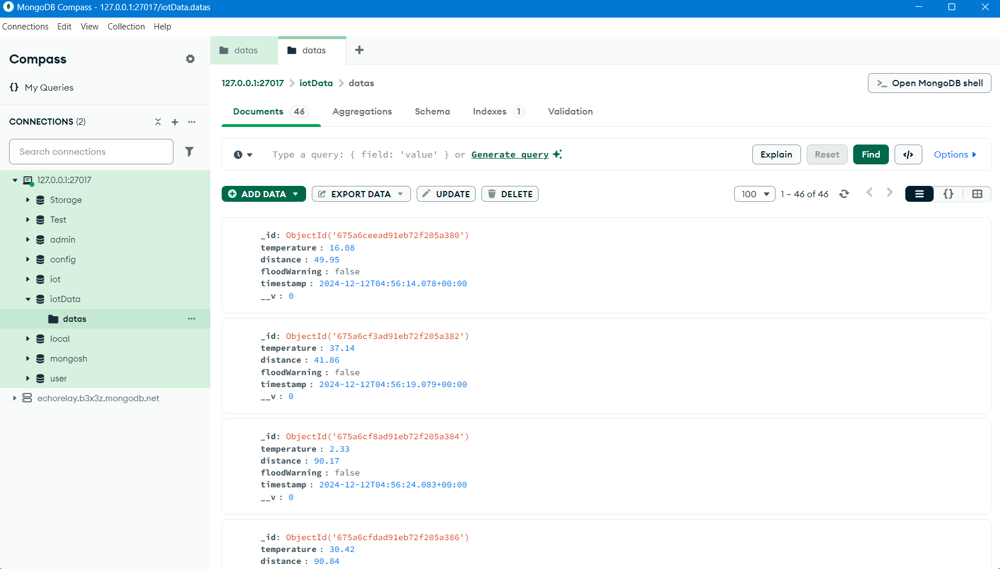

# FloodSense

Real-Time Flood Monitoring System Web App

## Table of Contents

* [Overview](#overview)
* [Key Features](#key-features)
* [Screenshots](#screenshots)
* [Hardware Requirements](#hardware-requirements)
* [Technical Requirements](#technical-requirements)
* [Installation and Setup](#installation-and-setup)
* [How It Works](#how-it-works)
* [Database Schema](#database-schema)
* [API Documentation](#api-documentation)
* [Socket.io Events](#socketio-events)
* [Contributing](#contributing)
* [License](#license)

## Overview

FloodSense is a Real-Time Flood Monitoring System Web App designed to provide communities with real-time flood data and alerts. It integrates IoT sensors and intuitive dashboards to empower users with actionable insights to prepare for and respond to flood events.

## Key Features

* Real-Time Monitoring: Collects live data from IoT sensors to monitor water levels and temperature.
* Custom Alerts: Users can configure personalized alerts to stay informed about specific flood conditions.
* Data Visualization: Provides interactive dashboards and geospatial maps for a comprehensive view of flood data.

## Screenshots

## IOT Dashboard

## Serial Monitor (Arduino IDE)

## MongoDB collection


## Hardware Requirements

* ESP32 Dev Module
* HC-SR04 Ultrasonic Sensor Module
* LM35 Temperature Sensor
* 16x2 LCD (I2C) Display
* LEDs lights
* Jumper Wires


## Software Requirements

* Backend: Node.js, Express.js
* Database: MongoDB
* Real-Time Communication: Socket.io
* IDE: Arduino IDE

## Installation and Setup

### ESP32 Dev Module Connections

#### Ultrasonic Sensor (HC-SR04)
* TRIG_PIN (18) → Connect the TRIG pin of the ultrasonic sensor to GPIO18 on the ESP32.
* ECHO_PIN (19) → Connect the ECHO pin of the ultrasonic sensor to GPIO19 on the ESP32.
* VCC → Connect the VCC pin of the ultrasonic sensor to the 5V pin of the ESP32 (note: some ESP32 boards can handle 5V input).
* GND → Connect the GND pin of the ultrasonic sensor to a GND pin on the ESP32.

  #### LM35 Temperature Sensor
* TEMP_PIN (34) → Connect the Vout pin of the LM35 sensor to GPIO34 (an ADC pin on the ESP32). This pin reads the analog temperature data.
* VCC → Connect the VCC pin of the LM35 to the 3.3V pin of the ESP32.
* GND → Connect the GND pin of the LM35 to the GND pin of the ESP32.

  #### LEDs (RED, ORANGE, GREEN)
* RED_LED (25) → Connect the long leg (anode) of the RED LED to GPIO25 on the ESP32, and the short leg (cathode) to a current-limiting resistor (typically 220Ω) and then to GND.
* ORANGE_LED (26) → Connect the long leg (anode) of the ORANGE LED to GPIO26, and the short leg (cathode) to a 220Ω resistor and then to GND.
* GREEN_LED (27) → Connect the long leg (anode) of the GREEN LED to GPIO27, and the short leg (cathode) to a 220Ω resistor and then to GND.

  #### Buzzer
* BUZZER_PIN (32) → Connect the long leg (anode) of the buzzer to GPIO32 on the ESP32, and the short leg (cathode) to GND.

### Prerequisites

* Node.js (v14 or higher)
* MongoDB (v4 or higher)
* npm (v6 or higher)

### Steps to Install

1. Clone the Repository:
```bash
git clone https://github.com/Tyler7x1/FloodSense.git
```
2. Navigate to the Project Directory:
```bash
cd FloodSense
```
3. Install Dependencies:
```bash
npm install
```
4. Set Up the Environment:
```bash
Rename .env.example to .env.
Add your MongoDB connection string and other environment variables.
```
5. Run the Setup Script:
```bash
npm run setup
```
6. Start the Server:
```bash
npm start
```

## How It Works

1. Data Collection: IoT sensors measure water levels, flow rates, and temperatures, sending this data to the server.
2. Data Storage: The server processes and stores sensor data in a MongoDB database.
3. Real-Time Communication: Using Socket.io, the server sends live updates to connected clients.
4. User Interaction: Users access data through a web dashboard with visualized insights and configurable alerts.

## Database Schema

The MongoDB database uses the following schema for flood data:
```json
{
  "temperature": {
    "type": "Number",
    "required": true
  },
  "distance": {
    "type": "Number",
    "required": true
  },
  "floodWarning": {
    "type": "Boolean",
    "required": true
  },
  "timestamp": {
    "type": "Date",
    "default": "Date.now"
  }
}
```

## API Documentation

### Endpoints

#### GET /

Description: Fetch the latest flood data.

Response:
```json
{
  "temperature": 25.5,
  "distance": 150.3,
  "floodWarning": false,
  "timestamp": "2024-12-12T08:00:00.000Z"
}
```

#### POST /data

Description: Add a new data entry.

Request Body:
```json
{
  "temperature": 26.1,
  "distance": 140.2,
  "floodWarning": true
}
```

#### GET /data

Description: Retrieve all flood data entries.

Response:
```json
[
  {
    "temperature": 25.5,
    "distance": 150.3,
    "floodWarning": false,
    "timestamp": "2024-12-12T08:00:00.000Z"
  },
  {
    "temperature": 26.1,
    "distance": 140.2,
    "floodWarning": true,
    "timestamp": "2024-12-12T09:00:00.000Z"
  }
]
```

## Socket.io Events

### newData

Description: Emits newly collected flood data to all connected clients.

Payload:
```json
{
  "temperature": 25.8,
  "distance": 145.6,
  "floodWarning": false
}
```

### disconnect

Description: Notifies the server when a client disconnects.

## Contributing

### Steps to Contribute

1. Fork the Repository:
```bash
git fork https://github.com/Tyler7x1/FloodSense.git
```
2. Create a New Branch:
```bash
git checkout -b feature/your-feature-name
```
3. Make Changes and Commit:
```bash
git commit -m "Add your feature description"
```
4. Push Changes:
```bash
git push origin feature/your-feature-name
```
5. Open a Pull Request via GitHub.

## License

This project is licensed under the MIT License. See the LICENSE file for more details.
